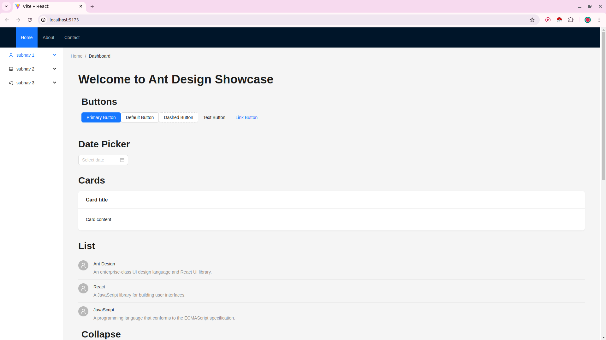

# React Styling Blocks

Code modules for reusable styling and component structures in React

## Options

1. Ant Design
2. CSS Modules
3. Emotion
4. React Bootstrap
5. Material UI (mui)
6. Tailwind

## Ant Design

- **Ant Design** is a popular design system and React UI library developed by Alibaba
- It provides high-quality, reusable components for building user interfaces in React
- **Ant Design** ensures design consistency with a comprehensive design language

**Resources:**

- [Ant Design](https://ant.design)
- [Ant Design - React](https://ant.design/docs/react/introduce)

**Preview:**



**Ant Design Module**

```
$ cd ./alternatives/ant-design
$ npm install
$ npm run dev

# Goto http://localhost:5173
```


___

## CSS Modules


___

## Emotion


___

## React Bootstrap


___

## Material UI (mui)


___

## Tailwind


___


